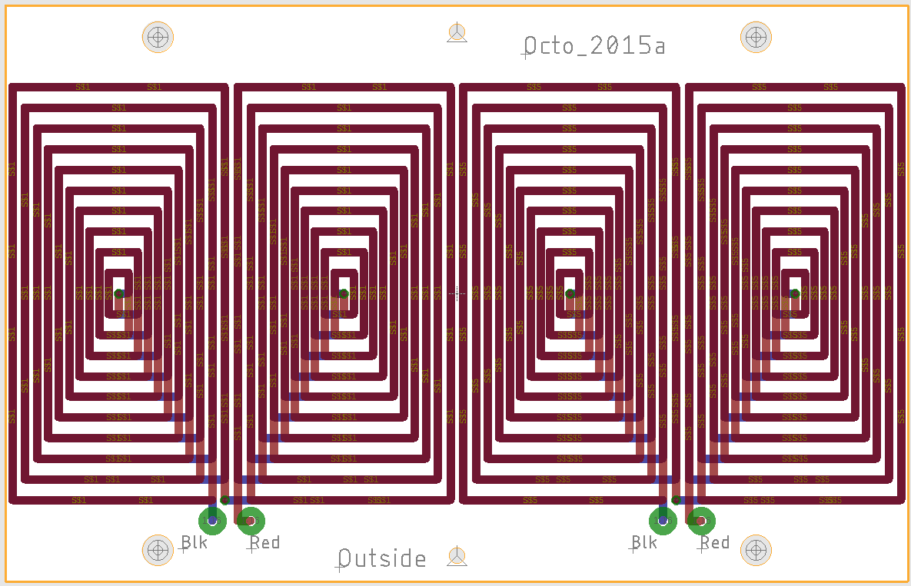

29 June 2016

# Description

Easily generate octupole or sextupole printed circuit magnet designs for particle accelerator nonlinear optics.
The sextupole code is [here](sextupole).

# Dependencies

Autodesk EAGLE Circuit Board CAD software to create gerber files.
Known to work for versions 8.7.1, 9.1.0, and 9.1.1

# How To
### To generate Gerber files
1. Run `DesignMagnet.m`
2. Run `MakePCB.m`
3. Open Autodesk EAGLE.  Create a new board (File -> New -> Board).
4. In the "Board" window, File -> Execute Script. Choose `BoardMacro.scr` in this directory.
5. To generate the NSF logo on the PCB, execute the `LogoMacroPCB.scr` script (File -> Execute Script).

Once satisfied with the design:

1. Save the board file (File -> Save)
2. In "Board" window: File -> CAM Processor
3. File -> Open -> Job...
4. Open `gerb274x.cam` for gerber files; open `excellon.cam` for excellon drilling files.
5. Click "Process Job" to generate the files.

### To clean the directory
Run (double-click) `cleandir.cmd`

# Sample Output
